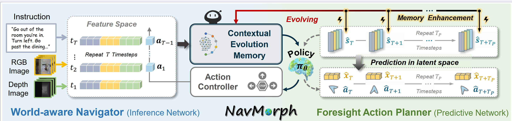

# NavMorph
NavMorph: A Self-Evolving World Model for Vision-and-Language Navigation in Continuous Environments

## Introduction



## Usage (New for HNR-Navmorph!)

### Prerequisites

1. Follow the [Habitat Installation Guide](https://github.com/facebookresearch/habitat-lab#installation) and [VLN-CE](https://github.com/jacobkrantz/VLN-CE) to install [`habitat-lab`](https://github.com/facebookresearch/habitat-lab) and [`habitat-sim`](https://github.com/facebookresearch/habitat-sim). We use version `v0.2.1` in our experiments.
   
2. Install `torch_kdtree` and `tinycudann`: follow instructions [here](https://github.com/MrZihan/Sim2Real-VLN-3DFF). 

3. Install requirements:
```setup
conda create --name morph python=3.7.11
conda activate morph
```
* Required packages are listed in `environment.yaml`. You can install by running:

```
conda env create -f environment.yaml
```
4. Please download the pretrained models and checkpoints from [GoogleDrive](https://drive.google.com/file/d/1x01wods-LUA6EyAD8C3ahiEaO8lKD6jy/view?usp=sharing).

### Online Evaluation

Use pseudo interative demonstrator to equip the model with our NavMorph:
```
bash run_r2r/main.bash eval 
```

### HNR-Navmorph

Use pseudo interative demonstrator to equip the model with our NavMorph:
```
bash run_r2r/main.bash train
bash run_r2r/main.bash eval 
```


## Notice:
Our codes are uploaded only for peer review, please do not distribute them. The code is used to reproduce our experimental results on R2R-CE dataset.
The complete code will be released if the paper is accepted.

